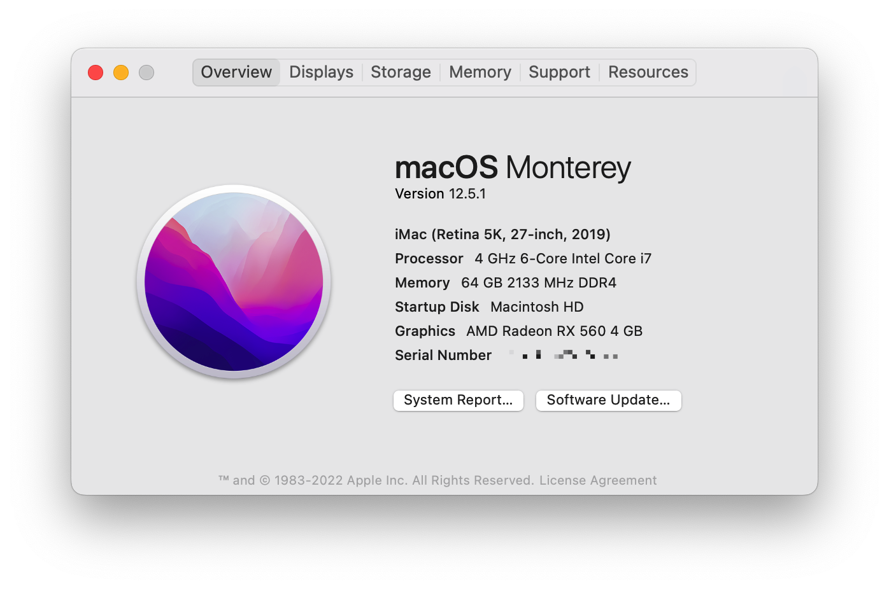
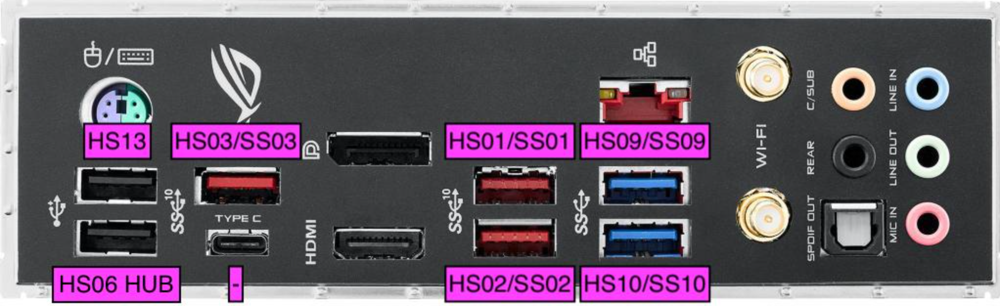
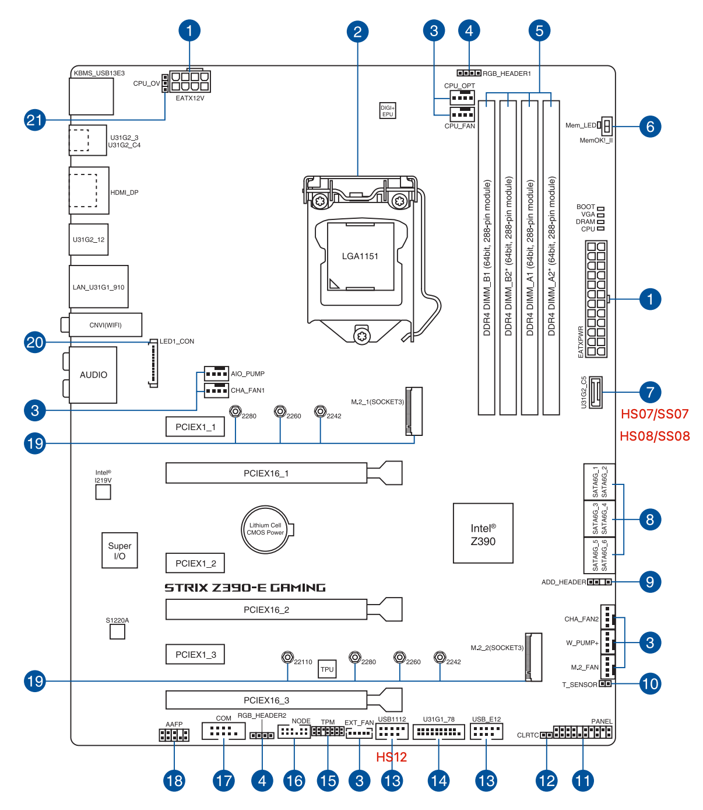

# Hackintosh for Asus ROG Strix Z390-E

[OpenCore 0.8.3](https://github.com/acidanthera/OpenCorePkg) macOS Monterey 12.5.1

## Hardware

- Case: CoolerMaster MC Pro5
- Motherboard: ASUS ROG STRIX Z390-E Gaming ATX
- CPU: Intel i7-8086K (12) @ 4.00GHz
- GPU: AMD Radeon RX 560
- RAM: Corsair Vengeance LPX DDR4 3000MHz (16Gx4)
- WIFI/Bluetooth: Fenvi T919
- Hard drive: SamSung SSD 970 EVO 500GB
- Cooler: Thermalright TL-C12B 12CM

## BIOS Settings

- Version: 2004
- Disable
  - Fast Boot
  - CSM
  - Secure Boot
  - VT-d
  - CFG Lock
  - Serial Port: Off
  - WiFi & Bluetooth
- Enable
  - Above 4G decoding
  - Hyper-Threading
  - XHCI Hand-off
  - OS type: Windows UEFI Mode

## USB Map

| Ports count | Enabled   | Comment                   |
| ----------- | --------- | ------------------------- |
| 2           | HS01/SS01 | 3.1 Gen 2                 |
| 2           | HS02/SS02 | 3.1 Gen 2                 |
| 1           | HS06      | Internal HUB - 2.0        |
| 2           | HS07/SS07 | 3.1 Gen 2                 |
| 2           | HS08/SS08 | 3.1 Gen 2                 |
| 2           | HS09/SS09 | 3.1 Gen 1                 |
| 2           | HS10/SS10 | 3.1 Gen 1                 |
| 1           | HS12      | Internal - Fenvi T919 2.0 |

